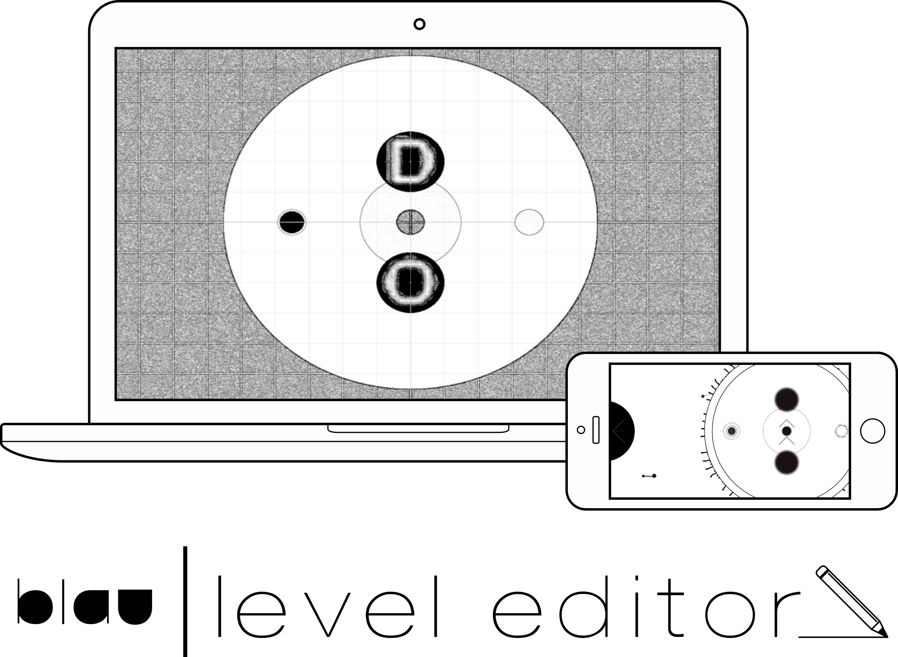
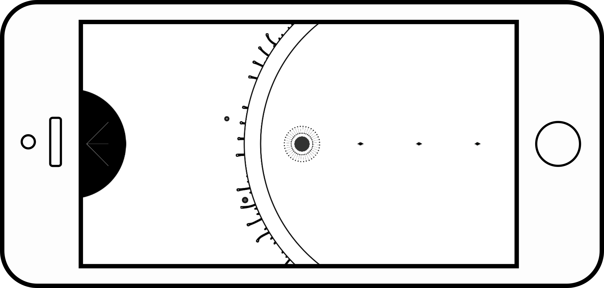
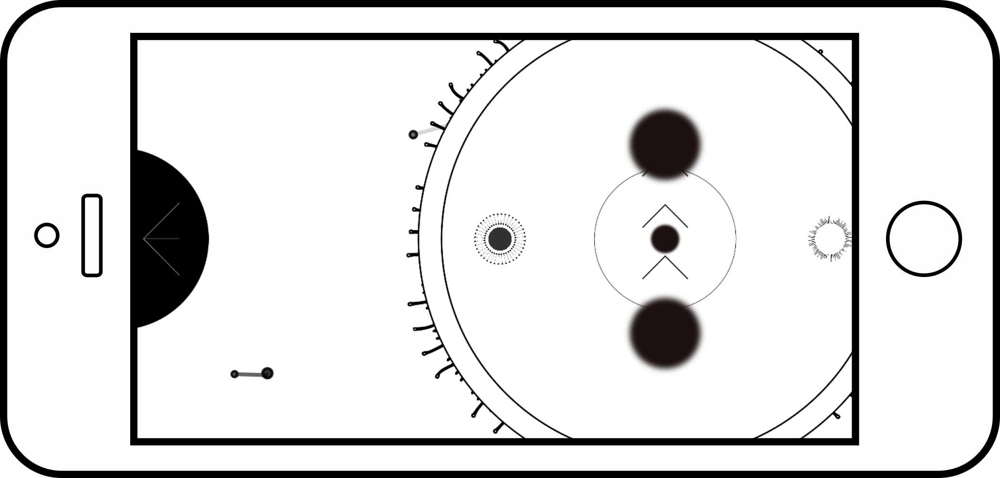

<p align="center">
  <a href="www.blaugame.com">
    
  </a>
</p>

<p align="center">
  Blau Game Official Level Designing Toolbelt - Made with Unity Engine.
</p>

## Table of Contents

- [The Game](#the-game)
- [Game Level Design Process](#game-level-design-process)
- [How The Level Editor Works](#how-the-level-editor-works)
- [Usage](#usage)
- [Contributing](#contributing)
- [License](#license)
- [Credits](#credits)

## The Game

<p align="center">
  <a href="https://itunes.apple.com/br/app/blau/id1150066458">
    
  </a>
</p>

**blau** is game where your goal is the simplest possible one: get to the end 
of each level. How? By guiding blau - actually, an abstract black circle - 
through many simple - yet elegant - puzzles, avoiding physics-based traps and collecting shapes; to every level, there are many solutions, which go from beautifully simple to deep and complex ones - **it all starts with a gesture, 
then evolves with physics, but the end is up to you**.

[Watch now the official game teaser!](https://www.youtube.com/watch?v=kNVg4-tiJzA)

<p align="center">
  <a href="https://itunes.apple.com/br/app/blau/id1150066458">
    
  </a>
</p>

## Game Level Design Process

**blau** has its core entirely writen in [Swift](https://developer.apple.com/swift/), using the [SpriteKit](https://developer.apple.com/spritekit/) framework.

As stated by the [official docs](https://developer.apple.com/reference/spritekit/skscene) provided by *Apple*:

> An SKScene object represents a scene of content in Sprite Kit. A scene is the root node in a tree of Sprite Kit nodes (SKNode). These nodes provide content that the scene animates and renders for display. To display a scene, you present it from an SKView object.

When it comes to **blau**, all the content that is rendered by our main scene is
fetched from a `.json` file. This file consists of an `array` of *level* 
`objects`.

> *Dev note*: [SwiftyJSON](https://github.com/SwiftyJSON/SwiftyJSON) was such 
a great choice for us when it comes to parsing *JSON* data; it gave us a much 
simpler and clearer syntax for doing it!

Here's a simple example of a *level* `object`:

```json
{
  "hero":{
    "position":[
      -350,
      0
    ]
  },
  "camera":{
    "position":[
      0,
      0
    ]
  },
  "finish":{
    "position":[
      350,
      0
    ]
  },
  "background":{
    "size":[
      1100,
      1100
    ]
  },
  "checkpoints":[
    {
      "position":[
        -350,
        0
      ]
    }
  ],
  "pickups":[
    {
      "position":[
        -175,
        0
      ],
      "collected":false
    },
    {
      "position":[
        0,
        0
      ],
      "collected":false
    },
    {
      "position":[
        175,
        0
      ],
      "collected":false
    }
  ]
}
```

Which is rendered to the following level scene:

<p align="center">
  
</p>

As can be noticed, data described in our *JSON* model consist basically of
*Cartesian coordinate system* plotting coordinates of our gameplay elements.

> Our gameplay elements aren't restricted to the mentioned above, there are 
a few others, e.g. `flows` and `vortexes` objects containing the respective positioning data - amongst other data - in more complex levels.

## How The Level Editor Works

This is a [Unity](https://unity3d.com/) project which takes advantage of 
*Unity*'s [scene editor](https://docs.unity3d.com/Manual/CreatingScenes.html) 
to ease our level design process. 

Instead of spending hours doing lots of maths to plot each gameplay element
correctly in our scenes, our level designers can now do it visually and then
have a simple *level* `object` in a valid *JSON* format generated.

Here's an example of a level in our editor:

<p align="center">
  
</p>

And this is the generated *JSON*:

```json
{
  "hero":{
    "position":[
      -350.0,
      0.0
    ]
  },
  "camera":{
    "position":[
      -350.0,
      0.0
    ]
  },
  "background":{
    "size":[
      1100.0,
      1100.0
    ]
  },
  "checkpoints":[
    {
      "position":[
        -350.0,
        0.0
      ]
    }
  ],
  "pickups":[
    {
      "position":[
        0.0,
        200.0
      ],
      "collected":false
    },
    {
      "position":[
        0.0,
        -200.0
      ],
      "collected":false
    }
  ],
  "flows":[
    {
      "center":[
        0.0,
        0.0
      ],
      "origin":[
        0.0,
        -200.0
      ],
      "destiny":[
        0.0,
        200.0
      ]
    }
  ],
  "vortexes":[
    {
      "position":[
        0.0,
        0.0
      ],
      "radius":150.0
    }
  ],
  "finish":{
    "position":[
      350.0,
      0.0
    ]
  }
}
```

Which is rendered to the following level scene:

<p align="center">
  
</p>

## Usage
